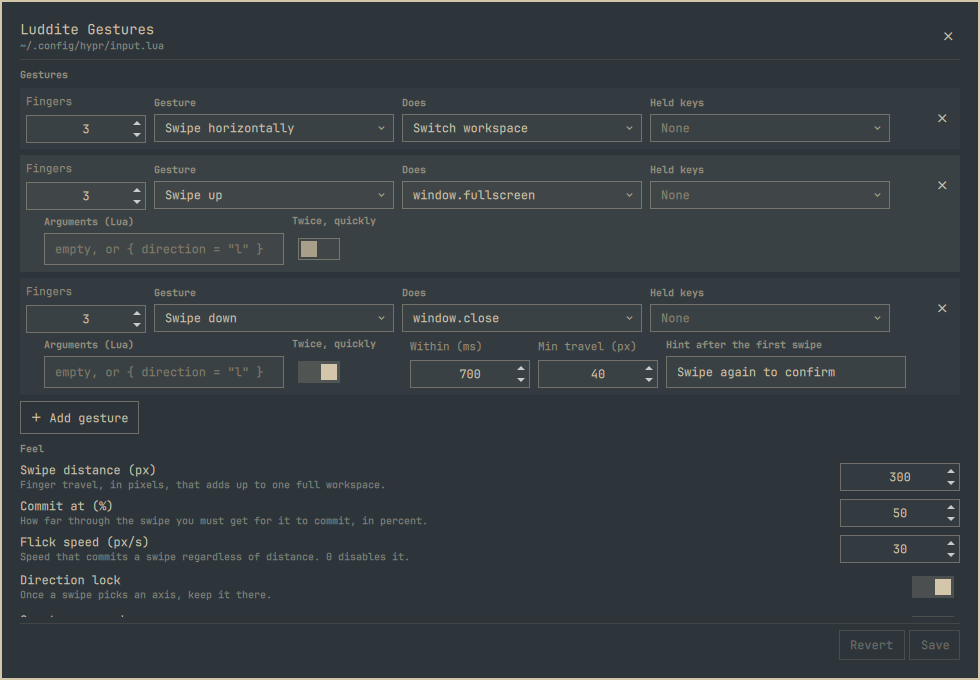

# Luddite Gestures

A panel for editing Hyprland touchpad gestures on [Omarchy](https://omarchy.org/),
and for telling you which of your swipes will never fire.



Hyprland's gesture engine has been good since 0.51. The configuration for it is
a Lua file, which is fine until you have five gestures and cannot remember
whether a three-finger `horizontal` swipe has quietly eaten the `left` one you
added last week. It has. This tells you before you save.

## Install

```bash
omarchy plugin add https://github.com/TechLuddite/LudditeGestures.git --enable --yes
```

Open it from **SUPER+SPACE › Luddite Gestures**. No network access, no sudo.

To remove it, `omarchy plugin remove io.github.techluddite.gestures --yes`. Your
gestures stay — they are plain Lua in the file Hyprland already reads.

## What it edits

| Section | What is there |
|---|---|
| **Gestures** | Finger count, direction, and action, plus the fields each action actually uses — a mode for fullscreen, a workspace name for special |
| **Written by hand** | Gestures found elsewhere in `input.lua`, read-only, shown so conflicts make sense |
| **Feel** | Swipe distance, commit threshold, flick speed, direction lock, create-new-workspace, swipe-forever, invert, close timeout |

Directions are `left`, `right`, `up`, `down`, `horizontal`, `vertical`, `swipe`
and `pinch`. Actions are `workspace`, `move`, `close`, `fullscreen`, `float`,
`special` and `resize`. Both lists were read out of Hyprland 0.56.2 by feeding
it candidates until it complained, rather than copied from documentation.

## Conflicts

Hyprland registers gestures in file order and refuses one whose reach an earlier
gesture already covers. The panel knows the same rule, so it can say so while
you are still editing:

> ✗ 3-finger swipe left never fires — a gesture written by hand on swipe
> horizontally already covers it.

It also flags the quieter case Hyprland accepts without comment: a partial
overlap, where the earlier gesture wins only for the directions the two share.
`swipe` covers everything except `pinch`; `horizontal` covers `left` and
`right`; `vertical` covers `up` and `down`.

## What it will not touch

Gestures whose action is a Lua function — a double-swipe with its own timing, a
custom dispatcher, anything with state — cannot be represented by three
dropdowns. Flattening one into an approximation would be the worst thing a GUI
like this could do, so it does not try. Those gestures are read, listed under
**Written by hand**, and counted when looking for conflicts. Nothing outside the
fenced block is ever rewritten.

## How it works

One managed block in `~/.config/hypr/input.lua`:

```lua
-- >>> luddite-gestures managed block >>>
hl.gesture({ fingers = 3, direction = "horizontal", action = "workspace" })
-- <<< luddite-gestures managed block <<<
```

Everything before and after the fences is yours. Saving splices the block in
place with an atomic write, runs `hyprctl reload`, and reports whatever
`hyprctl configerrors` says — Hyprland gets the last word on the file it just
read.

Reading state back is done by Lua, not by a parser. [`read.lua`](read.lua) runs
each segment of the file against recording stubs for `hl` and `o` and reports
what it set, so there is no second grammar to keep in sync with Hyprland's, and
a config that references helpers this plugin has never heard of still reads.
Chunks are loaded in text mode only, never as bytecode, and every stub only
records — nothing in your config is executed for its effects.

**There is no live preview, on purpose.** Hyprland offers no way to unregister a
gesture, so evaluating a draft would stack it on top of the real ones instead of
replacing them, and the preview would lie. Saving writes and reloads, which is
the only honest preview a gesture has: you have to put fingers on the touchpad
to know whether it feels right.

## Development

```bash
node test/run.js          # pure-JS tests for the renderer, parser and conflicts
omarchy plugin validate . # the same checks the shell enforces at install
```

Saving a file under `~/.config/omarchy/plugins/` hot-reloads plugin code, but it
does not re-instantiate a panel the shell has already created. A layout change
looks like it did nothing until `omarchy restart shell`, which is a good way to
waste an afternoon chasing a bug you already fixed.

The test suite pins the shadow-coverage table against the lattice measured from
Hyprland 0.56.2, so if a future release changes the rule, the tests say which
cell moved. It also renders a hostile workspace name, runs the result through
Lua for real, and asserts it comes back as one inert string.

## License

MIT — see [LICENSE](LICENSE).
