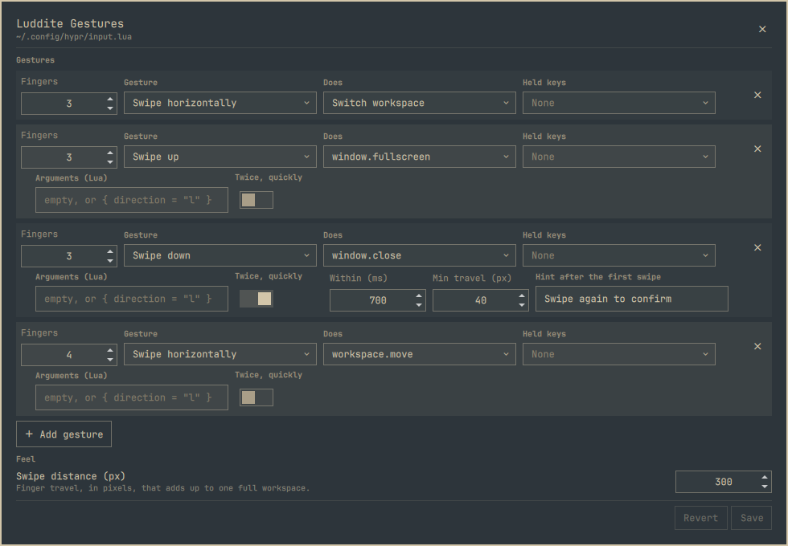

# Luddite Gestures

A panel for editing Hyprland touchpad gestures on [Omarchy](https://omarchy.org/),
and for telling you which of your swipes will never fire.



Hyprland's gesture engine has been good since 0.51. The configuration for it is
a Lua file, which is fine until you have five gestures and cannot remember
whether a three-finger `horizontal` swipe has quietly eaten the `left` one you
added last week. It has. This tells you before you save.

## How it differs

There are other ways to get gestures onto an Omarchy touchpad, and most of them
keep their own copy of your settings and generate a Lua file from it. This one
edits the file Hyprland already reads, and keeps nothing else:

- **It reads before it writes.** Every `hl.gesture` in `input.lua` is shown,
  including the ones you wrote by hand and the ones another tool generated. A
  gesture the panel did not write is listed, counted for conflicts, and never
  touched.
- **It says what will not fire.** Hyprland registers gestures in file order and
  silently drops a later one whose reach an earlier one already covers. You see
  that while editing, not after a reload.
- **It owns one fenced block.** Nothing outside the fences is rewritten, a save
  with no edits is byte-identical, and removing the plugin leaves your gestures
  in place as plain Lua. There is no generated file to clean up and no backup to
  restore.
- **It offers what a keybind can do.** The nine gesture actions Hyprland has, and
  every dispatcher, with a compile check before any of it reaches the file.

## Install

```bash
omarchy plugin add https://github.com/TechLuddite/luddite-gestures.git --enable --yes
```

It puts one touchpad icon in the right section of the bar. Click it and the
panel opens under it, like every other icon's popup. Or open it from
**SUPER+SPACE › Luddite Gestures**. No network access, no sudo.


The icon is where the shell keeps a widget plugin's on switch: `omarchy plugin
disable io.github.techluddite.gestures` takes it off the bar and stops the
plugin, and `enable` puts it back. To have it elsewhere:

```bash
omarchy plugin enable io.github.techluddite.gestures --section left
```

To remove it, `omarchy plugin remove io.github.techluddite.gestures --yes`. Your
gestures stay — they are plain Lua in the file Hyprland already reads.

### Upgrading from 0.1

The first release had no bar icon, so an existing install is recorded in
`shell.json` as a plain plugin rather than as a widget, and the shell cannot move
that entry into the bar — `enable --section right` reports success and changes
nothing. Disable, then enable, and restart the shell so it sees the new file:

```bash
omarchy plugin update io.github.techluddite.gestures --yes
omarchy plugin disable io.github.techluddite.gestures
omarchy plugin enable io.github.techluddite.gestures --section right
omarchy restart shell
```

The restart is not optional. A running shell only lists a plugin's directory
once; a file that was not there at that first look fails to load with `File name
case mismatch` or `No such file or directory` until the shell starts again.

## What it edits

| Section | What is there |
|---|---|
| **Gestures** | Finger count, direction, action and held modifiers, plus the fields each action actually uses — a mode for fullscreen, a workspace name for special, a scale for scroll, arguments for a dispatcher. Each gesture is banded in the theme's own colours so a column of them does not read as one wall |
| **Written by hand** | Gestures found elsewhere in `input.lua`, read-only, shown so conflicts make sense |
| **Feel** | Swipe distance, commit threshold, flick speed, direction lock, create-new-workspace, swipe-forever, invert, close timeout |

Directions are `left`, `right`, `up`, `down`, `horizontal`, `vertical`, `swipe`,
`pinch`, `pinchin` and `pinchout`. The built-in actions are `workspace`, `move`,
`close`, `fullscreen`, `float`, `special`, `resize`, `scroll_move` and
`cursor_zoom`. Both lists were read out of Hyprland 0.56.2 by feeding it
candidates until it complained, rather than copied from documentation.

**Does** offers more than those nine, though. Underneath them sit all 51
dispatchers — everything you could put on a keybind, walked out of the running
compositor rather than copied from anywhere — so a gesture can do whatever a key
can. Pick one and a field appears for its arguments, written the way a keybind
writes them: `{ direction = "l" }`, `"magic"`, or nothing at all. The list is
long, so the control is searchable.

Hyprland's gesture parser only knows the nine, so a gesture on a dispatcher is a
Lua callback — which the panel writes, and reads back into the same dropdowns.
Argument text becomes Lua in your config, so nothing is written until it has been
compiled: a save that would not parse is refused rather than saved and
apologised for once `input.lua` is already broken.

Hyprland is looser about spelling than the dropdown is: it takes `l`, `horiz`,
`VERT` and `zoomin` as well as the long names, and its own parser reports every
one of them under the same canonical direction. A config that uses the short
forms reads correctly and conflicts correctly; the panel just writes the long
name back, and only inside its own block.

## Conflicts

Hyprland registers gestures in file order and refuses one whose reach an earlier
gesture already covers. The panel knows the same rule, so it can say so while
you are still editing:

> ✗ 3-finger swipe left never fires — a gesture written by hand on swipe
> horizontally already covers it.

It also flags the quieter case Hyprland accepts without comment: a partial
overlap, where the earlier gesture wins only for the directions the two share.
`swipe` covers every swipe and no pinch at all; `horizontal` covers `left` and
`right`; `vertical` covers `up` and `down`; `pinch` covers both `pinchin` and
`pinchout`, while neither half covers the other.

## What it will not touch

Gestures whose action is a Lua function — a double-swipe with its own timing, a
custom dispatcher, anything with state — cannot be represented by three
dropdowns. Flattening one into an approximation would be the worst thing a GUI
like this could do, so it does not try. Those gestures are read, listed under
**Written by hand**, and counted when looking for conflicts. Nothing outside the
fenced block is ever rewritten.

One case is worth calling out, because the panel used to get it wrong: a
callback gesture written *inside* the fences is not safe there. Saving rewrites
the whole block, and no dropdown can hold a Lua function, so it would go. The
panel now says so rather than listing it among the gestures it leaves alone —
move it above the opening fence and it is yours again.

## Twice, quickly

Hyprland matches a single swipe. There is no double-swipe direction and no field
to ask for one, so a "swipe again to confirm" guard has to be timed in Lua.

That is a checkbox in the panel. Tick **Twice, quickly** on a gesture and it
writes the timing helper into its own block, along with the gap you will accept
between the two swipes, how far the fingers have to travel before a swipe counts
at all, and the hint to show after the first one. Reading the block back gives
you the gesture in the dropdowns again, not an opaque callback — the helper is
written so that [`read.lua`](read.lua) can record its calls as data instead of
running them, which is the same Lua-reads-Lua trick the rest of the panel uses.

It is offered where it can be got right, and nowhere else:

| | Guard offered | Why |
|---|---|---|
| any dispatcher | yes | The call is yours, argument text and all — there is nothing here for this side to get wrong |
| `close`, `float` | yes | Discrete, and dispatched with no argument at all |
| `fullscreen`, `special` | no | Their dispatchers take an argument whose Lua spelling could not be pinned down — `hl.dsp.window.fullscreen("0")` and `("1")` both produced plain fullscreen, so the argument appears to be ignored |
| `workspace`, `move`, `resize`, `scroll_move`, `cursor_zoom` | no | Continuous: they track your fingers 1:1, and there is no "twice" to speak of |
| any pinch | no | The guard measures finger travel out of each update's `delta`; a pinch reports its motion differently |

Generating a call whose behaviour cannot be predicted into someone's window
manager config is not worth a checkbox, so those cases simply do not offer one.

A guarded gesture is still an ordinary gesture of its direction as far as
Hyprland is concerned, so it shadows and is shadowed exactly like any other, and
the conflict warnings above apply to it unchanged.

### Anything more than that

A double swipe is the one callback shape the panel writes for you. Everything
else with state — a custom dispatcher, a gesture with its own submap, anything
that has to remember more than "did this just happen" — is still yours to write
above the fence. The panel will read it, list it under **Written by hand**, and
count it against your other gestures without touching it.

## How it works

One managed block in `~/.config/hypr/input.lua`:

```lua
-- >>> luddite-gestures managed block >>>
hl.gesture({ fingers = 3, direction = "horizontal", action = "workspace" })
-- <<< luddite-gestures managed block <<<
```

Everything before and after the fences is yours. Saving splices the block in
place with an atomic write, runs `hyprctl reload`, and reports whatever
`hyprctl configerrors` says — Hyprland gets the last word on the file it just
read.

Reading state back is done by Lua, not by a parser. [`read.lua`](read.lua) runs
each segment of the file against recording stubs for `hl` and `o` and reports
what it set, so there is no second grammar to keep in sync with Hyprland's, and
a config that references helpers this plugin has never heard of still reads.

That run is sealed. The config is loaded in text mode only, never as bytecode,
into an environment that holds the recorders and the pure parts of the standard
library and nothing else: no `os`, `io`, `require`, `load`, `dofile`, `debug`
or `print`. A hand-written `os.getenv("HOME")` resolves to an inert value that
answers to anything and does nothing, so the file still reads to the end, and
nothing it says can run a command, open a file, or load code. The interpreter
itself is started with a cleared environment, so a `LUA_INIT` cannot reach it
either.

**There is no live preview, on purpose.** Hyprland offers no way to unregister a
gesture, so evaluating a draft would stack it on top of the real ones instead of
replacing them, and the preview would lie. Saving writes and reloads, which is
the only honest preview a gesture has: you have to put fingers on the touchpad
to know whether it feels right.

## Development

```bash
node test/run.js          # pure-JS tests for the renderer, parser and conflicts
omarchy plugin validate . # the same checks the shell enforces at install
```

[`CLAUDE.md`](CLAUDE.md) is the working-notes file: how facts about Hyprland get
measured rather than quoted, what the panel is and is not allowed to touch, and
the QML traps that cost real time. Read it before changing how the block is
written.

Saving a file under `~/.config/omarchy/plugins/` hot-reloads plugin code, but it
does not re-instantiate a panel the shell has already created. A layout change
looks like it did nothing until `omarchy restart shell`, which is a good way to
waste an afternoon chasing a bug you already fixed.

The test suite pins the shadow-coverage table against the 10×10 lattice measured
from Hyprland 0.56.2, so if a future release changes the rule, the tests say
which cell moved. Measuring it takes a `hyprctl reload` between every single
cell: a probe that registers successfully stays live and shadows the next one,
which quietly turns a whole row into nonsense.

It also renders a hostile workspace name, runs the result through Lua for real,
and asserts it comes back as one inert string; and it checks in the QML source
what QML itself will not — that the gesture Repeater is driven by the row count
rather than the array, because feeding it the array rebuilds every row on every
keystroke, destroying the control being used inside its own signal handler.

## License

MIT — see [LICENSE](LICENSE).
